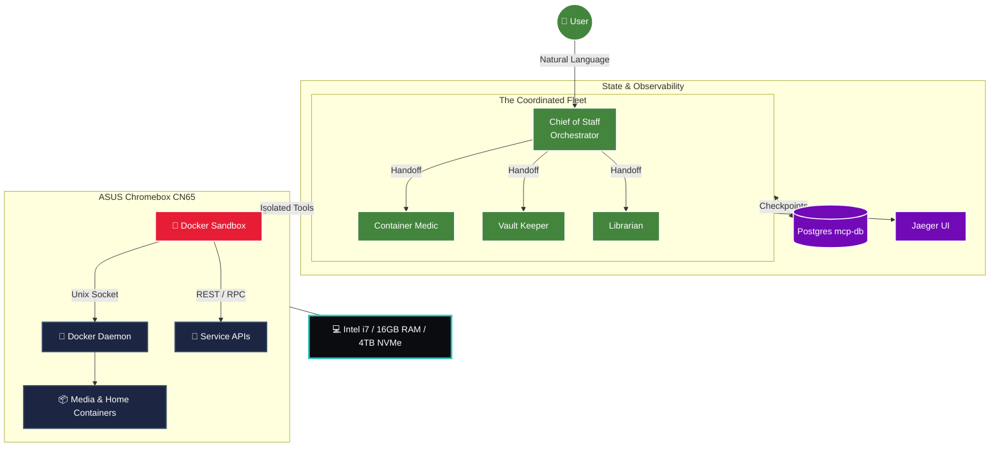

# 🏠 Autonomous Home Server Infrastructure: Golden Architecture

Welcome to the definitive source of truth for the **ASUS Chromebox CN65** home server. This ecosystem is a master-tier, AI-orchestrated infrastructure governed by a **Coordinated AI Agency** under the Gemini CLI framework.

---

## 📖 Strategic Documentation
*   🏗️ **[Modernization Report (March 2026)](./docs/MODERNIZATION_REPORT_MARCH_2026.md)**: Canonical record of the system-wide upgrade.
*   👑 **[Fleet Manifest (FLEET.md)](./FLEET.md)**: Org chart and handoff protocols for the AI Agency.
*   🏗️ **[Architecture Decision Document (ADD)](./docs/ADD.md)**: The "Why" behind the system design.
*   🛠️ **[Technical Design Document (TDD)](./docs/TDD.md)**: Developer guide for the TypeScript MCP server.
*   📖 **[User Manual](./docs/UserManual.md)**: Operational guide for interacting with AI agents.
*   📜 **[Operational Standards (GEMINI.md)](./GEMINI.md)**: The core mandates for AI behavior.

---

## 🔍 The "Golden" Standards (Tier 6)

### 1. Stateful AI Memory (`mcp-db`)
Unlike traditional "stateless" agents, this system utilizes a dedicated **PostgreSQL 16** instance (`mcp-db`) to track task progress, register thread checkpoints, and manage a human-in-the-loop approval queue. This allows for multi-hour autonomous tasks (like deep SSD audits) that survive system restarts.

### 2. Hierarchical AI Fleet (The Agency)
Operational tasks are delegated to specialized **AI Personas** with strict domains and personality-driven workflows:
*   **Chief of Staff:** High-level orchestrator and quality reviewer.
*   **Container Health Medic:** Clinical Docker diagnostics and auto-healing.
*   **Vault Keeper:** Paranoid enforcer of 1Password and VPN integrity.
*   **Library Librarian:** Fastidious guardian of media structural purity.

### 3. High-Security Isolation (Sandboxing)
Every AI-generated shell command or file modification is physically isolated within a **Docker Sandbox**. The host OS is protected by a "No-Fly Zone" policy, ensuring that the AI can never accidentally touch critical system binaries or personal home data.

---

## 🏗️ High-Level Control Architecture

---

## ⚡ Cost Efficiency & Intelligence Tiers

The system employs **Intelligence Tiers** to optimize for both performance and token cost:
*   **Tier 1: Fast Efficiency (`home-server-fast`)**: Uses **Gemini 3 Flash** for routine status checks, listing files, and monitoring.
*   **Tier 2: Deep Reasoning (`home-server-pro`)**: Uses **Gemini 3.1 Pro** with **Native Python Code Execution** and **Google Search** for complex audits and remediation.

---

## 🛡️ Security Posture (Zero-Trust)

1.  **1Password Service Accounts:** No plaintext credentials exist on disk. Authentication is permanently exported at the shell level for silent resolution.
2.  **Semantic Reflection Pass:** Every Docker-compose change is audited by a **Reflection Node** (`docker_critic.sh`) that queries the vector memory for mandate compliance before any command is shown to the user.
3.  **Folder Trust:** Global perimeter security restricts AI automation to authorized workspaces.

---

## 📂 Repository Structure

| Path | Description |
| :--- | :--- |
| [`/srv/scripts/ai/`](./scripts/ai/) | Unified AI Control Plane (Reflection, Briefings, Hooks). |
| [`/docker/home-server/`](./docker/home-server/) | Core application stack (30+ containers). |
| [`/docker/mcp-server/`](./docker/mcp-server/) | AI Infrastructure (mcp-db, jaeger, home-server-ts). |
| [`/.gemini/agents/`](./.gemini/agents/) | The AI Agency profiles and division mandates. |

---

  <i>This documentation is autonomously maintained by the <b>Chief of Staff AI Agent</b>.</i>

